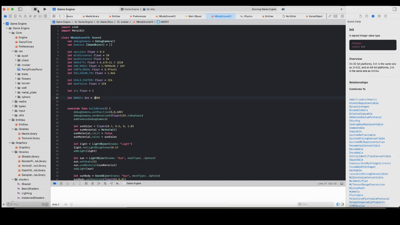

# N-BODY SIMULATION

## About this project 

N-Body Simulation for the CMDA4634 class at Virginia TECH during the Fall '24 semester.

The repository contains a Swift implementation with Metal to leverage GPU computations to create a N Body simulation in 3d.

The initial "Game Engine" code comes from : https://github.com/twohyjr/Metal-Game-Engine-Tutorial

The initial code implementation comes from this CUDA 2D implementation : https://github.com/Hsin-Hung
